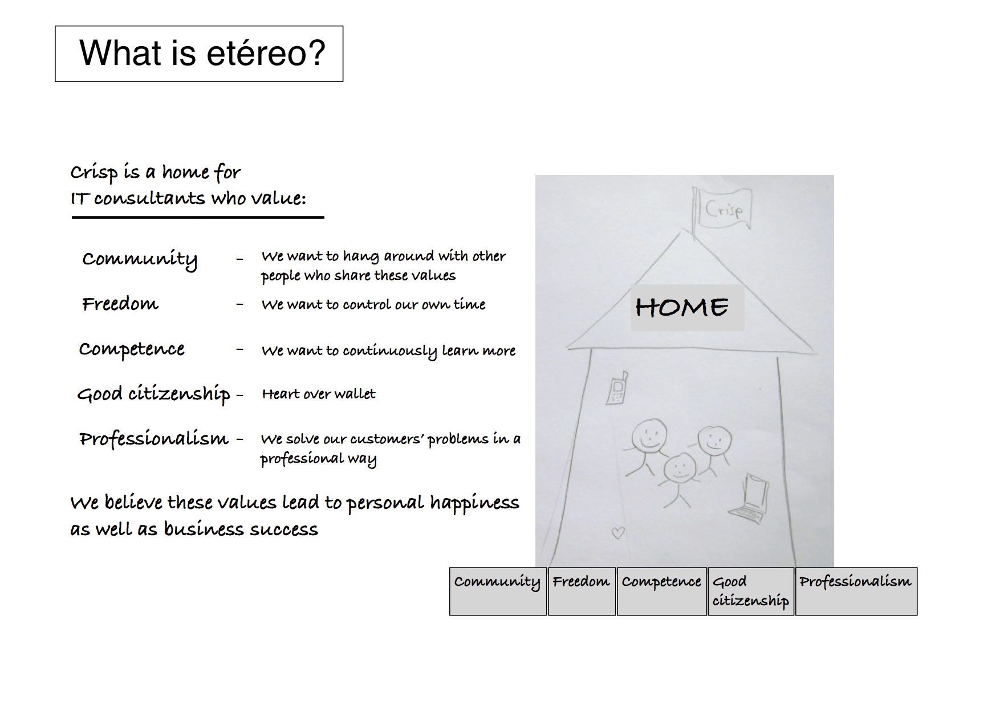

What is etéreo and why?
======================

Our purpose is summarized in this picture. We refer to this as "our home" or "our house".

It hangs on the wall in our office, and we bring it to our conferences so it can be easily updated (it's written in pencil...). Here's what it says:

**etéreo is a home for IT consultants who value:**

-   **Community** - We like to hang out with people who share our values
-   **Freedom** - We want to control our own time
-   **Competence** - We want to continuously learn
-   **Good citizenship** - Heart over wallet (money isn't the main thing in life)
-   **Professionalism** - We genuinely care about solving our customers problems

We believe these values lead to personal happiness as well as business success.

Basically, we're trying to find the magic balance between being an independent consultant (full freedom, no support), and being an employee (little freedom, lots of support).

In geek-terms, etéreo is a "runtime environment for consultants" :o)

> If you [clone the etéreo model](how-to-copy.html), you don't necessarily have to have the same values. Use your values! What's important to you and your buddies? However, our model is very much derived from our core values. So the closer your values are to ours, the better our model will fit your context.
